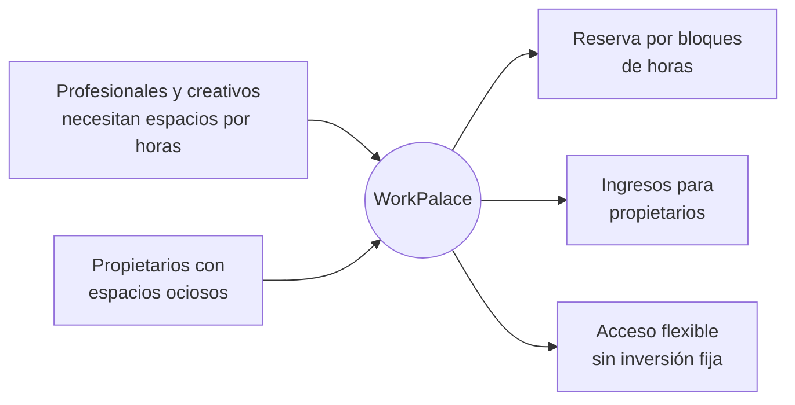

<div align="center">

# WorkPalace

### Reserva de espacios especializados por horas en Medellín

> Proyecto en fase inicial: la plataforma está enfocada en conectar usuarios con espacios especializados disponibles por bloques de tiempo.

> Este repositorio incluye la versión actual del frontend y del backend para la gestión de reservas.

Estudios de grabación · Cocinas industriales · Talleres de carpintería · Estudios fotográficos


[Descripción](#descripción) · [Problema](#problema) · [Solución](#solución) · [Cifras](#cifras-iniciales) · [Funcionalidades](#funcionalidades-clave) · [Calidad](#atributos-de-calidad) · [Equipo](#equipo)

</div>

---

## Descripción

Muchos profesionales independientes, emprendedores y creativos en Medellín requieren acceso a espacios especializados para desarrollar su actividad económica. Sin embargo, la inversión permanente en este tipo de infraestructura resulta inasumible para la mayoría de ellos, especialmente cuando el uso es esporádico u ocasional.

Paralelamente, la ciudad presenta un alto nivel de espacios especializados infrautilizados: instalaciones que permanecen ociosas durante buena parte del día o de la semana, lo que representa una pérdida de oportunidades económicas tanto para sus propietarios como para el ecosistema productivo local.

## Problema

| Pregunta | Respuesta |
|---|---|
| ¿Qué problema existe? | Acceso limitado a infraestructura costosa combinado con la existencia de espacios vacíos que generan pérdida de oportunidades económicas para propietarios y usuarios. |
| ¿A quién afecta? | Profesionales independientes, emprendedores, creativos y propietarios de espacios infrautilizados en Medellín. |

## Solución

**WorkPalace** conecta ambas puntas del mercado con un canal confiable, seguro y accesible:



## Cifras iniciales

> **Demanda.** Estudios locales evidencian una demanda sostenida de espacios especializados por bloques de horas, en lugar de arrendamientos permanentes o de largo plazo.

> **Perfil del mercado.** La investigación de Karla Bibiana Mora Martínez (2015) reporta que aproximadamente el 22.3% de la población de trabajadores independientes analizada corresponde a hombres de alrededor de 45 años, lo que sugiere un segmento significativo de profesionales maduros que ejercen su actividad de forma autónoma y sin infraestructura propia permanente.

### Modelo de negocio

| Plan | Comisión por reserva | Ganancia estimada por reserva (usuario) |
|:---:|:---:|:---:|
| **Normal** | **15%** | $34.000 – $36.000 COP |
| **Pro** | **10%** | $34.000 – $36.000 COP |

Estas cifras dimensionan el volumen económico que actualmente no se está capturando por la falta de un canal formal de intermediación.

> **Ineficiencia de mercado.** Existe oferta de infraestructura ociosa y demanda insatisfecha de acceso flexible, pero no existe un mecanismo confiable, seguro y accesible que conecte ambas partes.

## Funcionalidades clave

| Icono | Funcionalidad |
|:---:|---|
|  | **Reservas por bloques horarios** |
|  | **Pagos en línea** |
|  | **Verificación de identidad** |
|  | **Disponibilidad en tiempo real** |
|  | **Filtros y búsqueda avanzada** |

## Atributos de calidad

Seleccionados bajo el estándar **ISO/IEC 25010**:

| Seguridad | Fiabilidad | Usabilidad | Eficiencia de desempeño |
|:---:|:---:|:---:|:---:|
|  |  |  |  |

## Tecnologías

| Capa | Tecnología |
|---|---|
| Backend | Node.js + Express |
| Frontend |  |
| Despliegue del frontend |  |
| Despliegue del backend |  |
| Base de datos | PostgreSQL en [Neon](https://neon.tech/) |

## Documentación de arquitectura

- ADR 001: Selección de Estilo Arquitectónico: [docs/adr/ADR-001-Seleccion-de-Estilo-Arquitectonico.md](docs/adr/ADR-001-Seleccion-de-Estilo-Arquitectonico.md)

## Inicio rápido

> Nota: para ejecutar el proyecto, se recomienda tener Node.js 18 o superior.

1. Clona este repositorio.
2. Instala las dependencias:

```bash
npm install
```

3. Configura tus variables de entorno en un archivo `.env`:

```env
DB_NAME=WorkPalace
```

4. Inicia el servidor de desarrollo:

```bash
npm run dev
```

5. Si deseas levantar el backend por separado:

```bash
npm run server
```

## Equipo

| Integrante |
|---|
| **Diego Alejandro Morales Gómez** |
| **Daniel Antonio Sarmiento Amador** |
| **Andree Kal-El Marín Hernández** |

## Referencias

- Mora Martínez, K. B. (2015). Investigación sobre trabajadores independientes.

---

<div align="center">
Proyecto integrador · Medellín, Colombia
</div>
